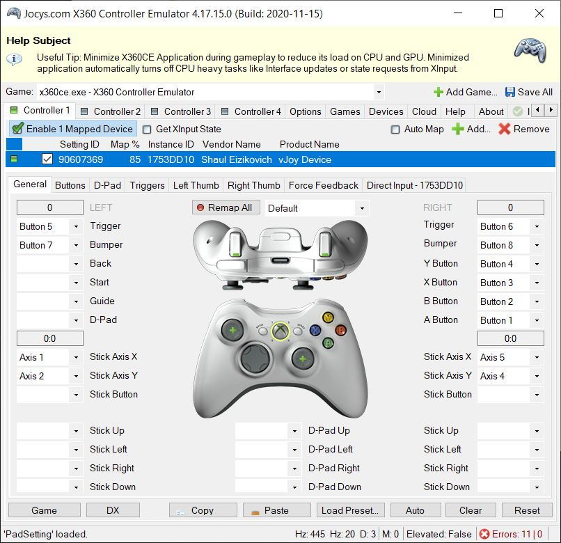

# HeavenlyBodeep
HeavenlyBodeep is a program developped to allow to play the game [Heavenly Bodies](https://heavenlybodiesgame.com/) via webcam instead of keyboard or joystick.
- 

## Getting started
You will need:
- The Heavenly Bodies game (compatibility with Windows only)
- vJoy and x360 (see [link](https://u.pcloud.link/publink/show?code=kZYDtXVZLL74XzxE9SfoSurJi4PnbJDv2bf7))
- The HeavenlyBodeep package

Settings for x360:


# Startup the project

The initial setup.

Create virtualenv and install the project:
```bash
sudo apt-get install virtualenv python-pip python-dev
deactivate; virtualenv ~/venv ; source ~/venv/bin/activate ;\
    pip install pip -U; pip install -r requirements.txt
```

Unittest test:
```bash
make clean install test
```

Check for HeavenlyBodeep in gitlab.com/{group}.
If your project is not set please add it:

- Create a new project on `gitlab.com/{group}/HeavenlyBodeep`
- Then populate it:

```bash
##   e.g. if group is "{group}" and project_name is "HeavenlyBodeep"
git remote add origin git@github.com:{group}/HeavenlyBodeep.git
git push -u origin master
git push -u origin --tags
```

Functionnal test with a script:

```bash
cd
mkdir tmp
cd tmp
HeavenlyBodeep-run
```

# Install

Go to `https://github.com/{group}/HeavenlyBodeep` to see the project, manage issues,
setup you ssh public key, ...

Create a python3 virtualenv and activate it:

```bash
sudo apt-get install virtualenv python-pip python-dev
deactivate; virtualenv -ppython3 ~/venv ; source ~/venv/bin/activate
```

Clone the project and install it:

```bash
git clone git@github.com:{group}/HeavenlyBodeep.git
cd HeavenlyBodeep
pip install -r requirements.txt
make clean install test                # install and test
```
Functionnal test with a script:

```bash
cd
mkdir tmp
cd tmp
HeavenlyBodeep-run
```
